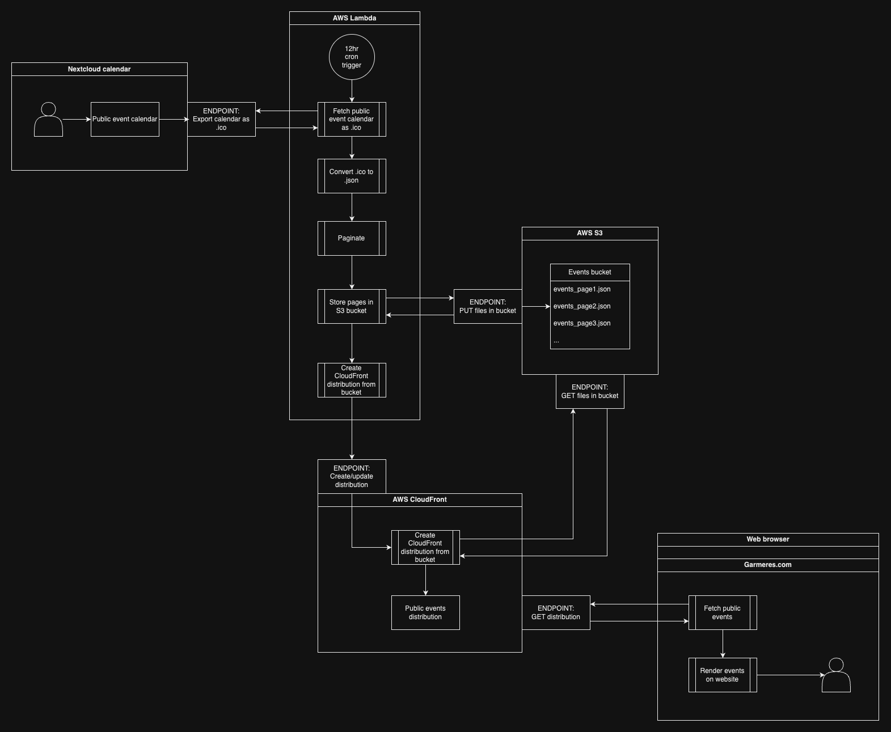

# Queer Hangout public event calendar

This repo is the source code for AWS infrastructure responsible for hosting an endpoint serving a list of upcoming
public events as defined in a public Google Calendar.

In other words, when a certain Google Calendar is updated, then this calendar's list of upcoming events will be served as json format from
https://events.api.queerhangout.no

## API

### `GET /`

#### Returns

```
{
  "source-url": string,
  "last-updated": string,
  "total-events": integer,
  "total-pages": integer,
  "per-page": integer,
  "events": [
    {
      "name": string,
      "description": string,
      "start": string,
      "end": string,
      "duration": string,
      "location": string
    }
  ]
}
```

### `GET /pages/{number}.json`

#### Returns
```
{
  "source-url": string,
  "last-updated": string,
  "events-in-page": integer,
  "total-events": integer,
  "page": integer,
  "total-pages": integer,
  "per-page": integer,
  "has-more": boolean,
  "events": [
    {
      "name": string,
      "description": string,
      "start": string,
      "end": string,
      "duration": string,
      "location": string
    }
  ]
}
```

## Getting started as a developer

### Install the prerequisites

Thw following must be installed on your machine:
- [Node.js v18.16.1](https://nodejs.org/en/download) (Install by running `source setup-node.sh`)
- [Python v3.9](https://www.python.org/)
- [PIP](https://pypi.org/project/pip/)
- [AWS cli v2.13.1](https://aws.amazon.com/cli/)
- [AWS CDK v2.86.0](https://docs.aws.amazon.com/cdk/v2/guide/getting_started.html) (Install by running
`npm install -g aws-cdk@2.86.0`)
- [Docker](https://www.docker.com/)

### Environment variables

Create a file named `.env`, and fill out the environment variables below.

```
# (Required) The AWS account number to deploy resources to
AWS_ACCOUNT_ID=

# (Required) The AWS default region to deploy resources to
AWS_DEFAULT_REGION=eu-north-1

# (Required) Download link for a public calendar's .ics file
CALENDAR_LINK=

# (Required) Globally unique name for the project. Prefix for all created resource names.
PROJECT_NAME=queer-hangout-calendar-sync

# (Required) The domain you will be using for the distribution
DOMAIN_NAME=events.api.queerhangout.no

# (Required) The CORS allowed domain, i.e. the domain of the frontend which will be fetching data from the distribution
CORS_ALLOWED_DOMAIN=https://queerhangout.no

# (Optional) Whether a secondary domain should be allowed. Must be either "True" or "False". (default: False)
ENABLE_CORS_ALLOWED_SECONDARY_DOMAIN=True

# (Optional) Secondary CORS allowed domain
CORS_ALLOWED_SECONDARY_DOMAIN=http://localhost:8000

# (Optional) Override the default AWS timezone variable (default: Europe/Oslo)
TZ=Europe/Oslo

# (Optional) Max number of events contained in a single page (default: 10)
EVENTS_PER_PAGE=10
```

### Authenticate for local development

Run `aws configure`. Enter your credentials for programmatic access, set the default region to `eu-north-1`, and the
default output format to `yaml`.

### Bootstrapping for CloudFormation

Run
- `cdk bootstrap aws://ACCOUNT-NUMBER/us-east-1`.
- `cdk bootstrap aws://ACCOUNT-NUMBER/eu-north-1`.

This will create a CDK toolkit CloudFormation stack with all the required resources for CDK.

### Install project dependencies

Run `pip install -r requirements.txt`

### Run Docker

Before deploying you need to make sure Docker is installed and running on your machine.

### Deploy to AWS

Run
- `cdk synth`
- `cdk deploy --all`

#### Verify certificate

If the project is being deployed for the first time in an AWS account, then you may have to approve of an AWS
certificate by e-mail.

#### Update DNS records

When the `CdkStack` stack has completed its deployment, it should print its distribution domain name as an output,
and it will look something like this:

````
Outputs:
CdkStack.distributiondomainname = xxx.cloudfront.net
````

Through the domain provider, add a CNAME record for the domain name for the distribution, and point it to the cloudfront
url from the distribution output.

### Invoke the calendar sync function

When all is deployed successfully, run the whole thing using the following command:

`aws lambda invoke --function-name=queer-hangout-calendar-sync-lambda --log-type=Tail function_out.json`

The response, along with any possible errors, will be printed to the file `function_out.json`.

## Architecture

Google Calendar offers an endpoint to export a given calendar. To reduce network traffic to Google API, the calendar shall
be exported once every 24 hours, processed into a list of events in JSON format and stored in an AWS S3 bucket. An AWS
CloudFront distribution will be created from this S3 bucket to reduce costs of requests. The website may then fetch a
list of events directly from the CloudFront distribution.


